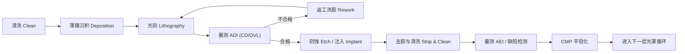
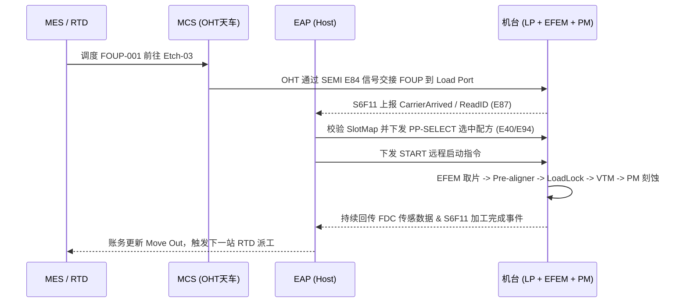

# 晶圆厂工艺与系统 Mermaid 流程图库

## 1. 七大单项工艺在一个循环中的闭环协作

```mermaid
flowchart LR
    C["清洗 Clean"] --> D["薄膜沉积 Deposition"]
    D --> L["光刻 Lithography"]
    L --> M1["量测 ADI (CD/OVL)"]
    M1 -- 不合格 --> RW["返工洗胶 Rework"] --> L
    M1 -- 合格 --> E["刻蚀 Etch / 注入 Implant"]
    E --> S["去胶与清洗 Strip & Clean"]
    S --> M2["量测 AEI / 缺陷检测"]
    M2 --> CMP["CMP 平坦化"]
    CMP --> NEXT["进入下一层光罩循环"]
```

---

## 2. 晶圆厂全自动传片与数据采集闭环

```mermaid
sequenceDiagram
    participant MES as MES / RTD
    participant MCS as MCS (OHT天车)
    participant EAP as EAP (Host)
    participant EQP as 机台 (LP + EFEM + PM)

    MES->>MCS: 调度 FOUP-001 前往 Etch-03
    MCS->>EQP: OHT 通过 SEMI E84 信号交接 FOUP 到 Load Port
    EQP-->>EAP: S6F11 上报 CarrierArrived / ReadID (E87)
    EAP->>EQP: 校验 SlotMap 并下发 PP-SELECT 选中配方 (E40/E94)
    EAP->>EQP: 下发 START 远程启动指令
    EQP->>EQP: EFEM 取片 -> Pre-aligner -> LoadLock -> VTM -> PM 刻蚀
    EQP-->>EAP: 持续回传 FDC 传感数据 & S6F11 加工完成事件
    EAP-->>MES: 账务更新 Move Out，触发下一站 RTD 派工
```
