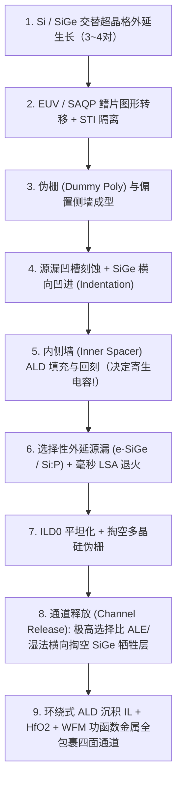
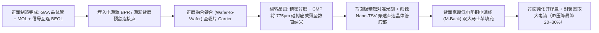

# GAA 纳米片（Nanosheet）与背面供电（BSPDN）集成工艺流程 Mermaid 图

## 1. GAA 纳米片核心制造关键链（2nm / 3nm 节点）

```mermaid
flowchart TD
    A["1. Si / SiGe 交替超晶格外延生长（3~4对）"] --> B["2. EUV / SAQP 鳍片图形转移 + STI 隔离"]
    B --> C["3. 伪栅 (Dummy Poly) 与偏置侧墙成型"]
    C --> D["4. 源漏凹槽刻蚀 + SiGe 横向凹进 (Indentation)"]
    D --> E["5. 内侧墙 (Inner Spacer) ALD 填充与回刻（决定寄生电容!）"]
    E --> F["6. 选择性外延源漏 (e-SiGe / Si:P) + 毫秒 LSA 退火"]
    F --> G["7. ILD0 平坦化 + 掏空多晶硅伪栅"]
    G --> H["8. 通道释放 (Channel Release): 极高选择比 ALE/湿法横向掏空 SiGe 牺牲层"]
    H --> I["9. 环绕式 ALD 沉积 IL + HfO2 + WFM 功函数金属全包裹四面通道"]
```

---

## 2. 背面供电网络（BSPDN / PowerVia / SPR）晶圆正反双面加工链路

```mermaid
flowchart LR
    F1["正面制造完成: GAA 晶体管 + MOL + 信号互连 BEOL"] --> F2["埋入电源轨 BPR / 源漏背面预留连接点"]
    F2 --> B1["正面融合键合 (Wafer-to-Wafer) 至载片 Carrier"]
    B1 --> B2["翻转晶圆: 精密背磨 + CMP 将 775μm 硅衬底减薄至数百纳米"]
    B2 --> B3["背面极精密对准光刻 + 刻蚀 Nano-TSV 穿透直达晶体管底部"]
    B3 --> B4["背面宽厚低电阻铜电源线 (M-Back) 双大马士革填充"]
    B4 --> B5["背面钝化开焊盘 + 封装直取大电流（IR压降暴降 20~30%）"]
```
