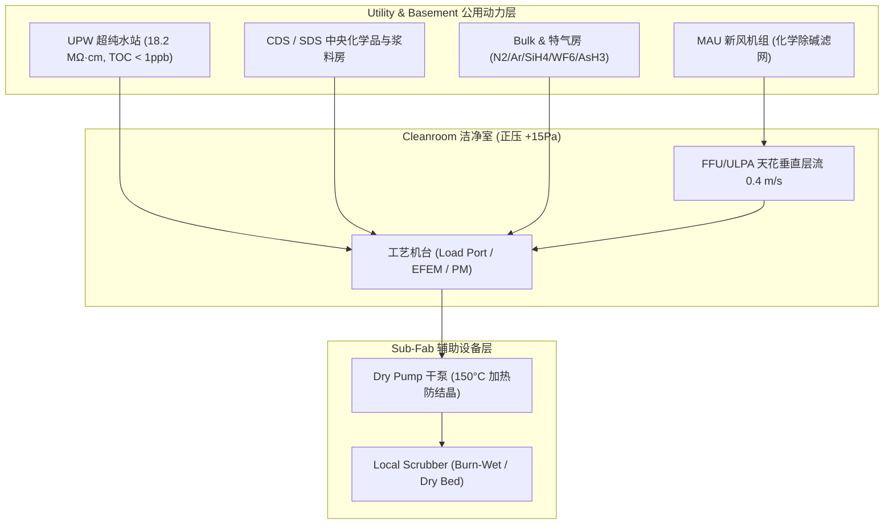
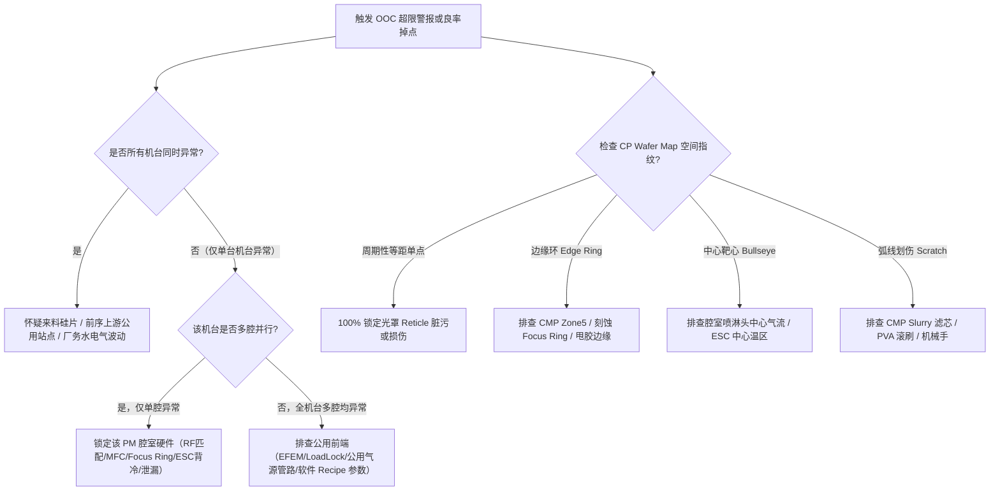

# Fab 厂务动力拓扑与 OOC 异常排错决策树（Mermaid）

## 1. 晶圆厂水电气化与废气安全闭环

```mermaid
flowchart TB
    subgraph "Utility & Basement 公用动力层"
        UPW["UPW 超纯水站 (18.2 MΩ·cm, TOC < 1ppb)"]
        CDS["CDS / SDS 中央化学品与浆料房"]
        GAS["Bulk & 特气房 (N2/Ar/SiH4/WF6/AsH3)"]
        MAU["MAU 新风机组 (化学除碱滤网)"]
    end

    subgraph "Cleanroom 洁净室 (正压 +15Pa)"
        FFU["FFU/ULPA 天花垂直层流 0.4 m/s"]
        TOOL["工艺机台 (Load Port / EFEM / PM)"]
    end

    subgraph "Sub-Fab 辅助设备层"
        PUMP["Dry Pump 干泵 (150°C 加热防结晶)"]
        SCRUB["Local Scrubber (Burn-Wet / Dry Bed)"]
    end

    UPW --> TOOL
    CDS --> TOOL
    GAS --> TOOL
    MAU --> FFU --> TOOL
    TOOL --> PUMP --> SCRUB
```

---

## 2. 产线发生 SPC OOC / 良率骤降排错决策树（Commonality Workflow）

```mermaid
flowchart TD
    S["触发 OOC 超限警报或良率掉点"] --> Q1{"是否所有机台同时异常?"}
    Q1 -- 是 --> C1["怀疑来料硅片 / 前序上游公用站点 / 厂务水电气波动"]
    Q1 -- 否（仅单台机台异常） --> Q2{"该机台是否多腔并行?"}
    Q2 -- 是，仅单腔异常 --> C2["锁定该 PM 腔室硬件（RF匹配/MFC/Focus Ring/ESC背冷/泄漏）"]
    Q2 -- 否，全机台多腔均异常 --> C3["排查公用前端（EFEM/LoadLock/公用气源管路/软件 Recipe 参数）"]

    S --> Q3{"检查 CP Wafer Map 空间指纹?"}
    Q3 -- 周期性等距单点 --> M1["100% 锁定光罩 Reticle 脏污或损伤"]
    Q3 -- 边缘环 Edge Ring --> M2["排查 CMP Zone5 / 刻蚀 Focus Ring / 甩胶边缘"]
    Q3 -- 中心靶心 Bullseye --> M3["排查腔室喷淋头中心气流 / ESC 中心温区"]
    Q3 -- 弧线划伤 Scratch --> M4["排查 CMP Slurry 滤芯 / PVA 滚刷 / 机械手"]
```
